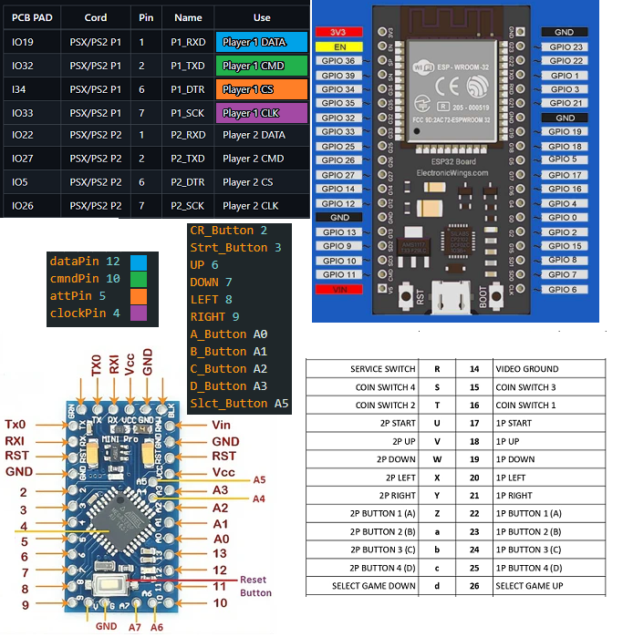

# PS1_NEOGEO/MVS to BLUERETRO
Forked from www.delta-island.com | GitHub Repository: [PS1-to-Neogeo-Adaptor](https://github.com/Delta-island/PS1-to-Neogeo-Adaptor)  
Using references from Blueretro by darthcloud | GitHub Repository: [BlueRetro](https://github.com/darthcloud/BlueRetro)  

This project implements the code to use an MVS NeoGeo by connecting directly to the PCB and consolizing the MVS with minimal effort. You will only need an Arduino Pro Mini/Mini (328p 5V) and an ESP32.  

Remember that the BlueRetro makes the MVS widely compatible with a huge list of Bluetooth controllers. [List tested devices](https://github.com/darthcloud/BlueRetro/wiki/Controller-pairing-guide#1---list-of-tested-bluetooth-devices)

## Key Changes:
**► Added Coin Button:** The L1 button is now used as the arcade coin button making MVS compatible.  
**► Pinout Disposition:** The pinout layout has been rewritten to simplify the connection to the MVS board.  
**► Joystick Option Modified:** Modified the R1 button to function as button A instead of the (X) button when L1 + R1 + Select are held for a few seconds. This is useful for Metal Slug and some shoot 'em up games.  

## Steps to Implement  
### Flash the Arduino Pro Mini or Mini (328p - 5V):
Use the "[ps1_to_neogeo_ctrl_V1_MVS_CREDIT_FINAL.ino](https://github.com/Gand46/PS1-to-MVS_to_Blueretro/blob/master/Arduino%20Nano%20Code/ps1_to_neogeo_ctrl_V1_MVS_CREDIT_FINAL.ino)" remember that you will need the "Psx" Lib, you find it on [Arduino Nano Code/lib/Psx](https://github.com/Gand46/PS1-to-MVS_to_Blueretro/tree/master/Arduino%20Nano%20Code/lib/Psx)  

**Tutorial Arduino for flash pro mini:** https://docs.arduino.cc/retired/getting-started-guides/ArduinoProMini/  

>**NOTE:** You will need one Arduino per player, as the MVS supports two players. However, you can choose to use only one if desired. Using the PSX-MVS_Blueretro allows for a single ESP32 instead of two when selecting the "Parallel 1P 5V (12 buttons) - Blueretro" option.

### Flash the BlueRetro with PSX/PS2 Controller Firmware:

Follow the BlueRetro Flashing firmware tutorial for this step [Here👈](https://github.com/darthcloud/BlueRetro/wiki/Flashing-firmware-Windows-10)

## Configure BlueRetro:
Access the web config  from your PC at blueretro.io. Connect to the BlueRetro via Bluethooth (will appear something like PS2XXXX) and navigate to the "Advanced Config Page".
and the "Global Config", in the System option, change the setting from "Default: Auto" to "PSX", click save button, and you are almost done.

## Connect Pinout from BlueRetro to Arduino:
There are only 4 pins to connect for each arduino Player 1 and Player 2 ***The ACK pin is not connected***

**PLAYER 1:**
>ESP32 - IO19 - DATA P1 - Arduino P1 - Pin 12  
>ESP32 - IO32 - CMD P1 - Arduino P1 - Pin 10  
>ESP32 - I34 - CS P1 - Arduino P1 - Pin 5  
>ESP32 - IO33 - CLK P1 - Arduino P1 - Pin 4  
>ESP32 - NC - ACK P1 - Arduino P1 - Pin N/A (Not Connected)  

**PLAYER 2:**

>ESP32 - IO22 - DATA P1 - Arduino P2 - Pin 12  
>ESP32 - IO27 - CMD P1 - Arduino P2 - Pin 10  
>ESP32 - IO5 - CS P1 - Arduino P2 - Pin 5  
>ESP32 - IO26 - CLK P1 - Arduino P2 - Pin 4  
>ESP32 - NC - ACK P1 - Arduino P2 - Pin N/A (Not Connected)  

## Connect Arduino to MVS:
[Pinout MVS](https://github.com/Gand46/PS1-to-MVS_to_Blueretro/blob/master/Images/Pinout-SNK-Neo-Geo-MVS_page-0001.jpg)  
**Player 1**  
MVS Pinout from 16 to 26  

P1 - Credit - Arduino Pin: 2 - MVS Pin: 16
P1- Start - Arduino Pin: 3 - MVS Pin: 17
P1- UP - Arduino Pin: 6 - MVS Pin: 18
P1- DOWN - Arduino Pin: 7 - MVS Pin: 19
P1- LEFT - Arduino Pin: 8 - MVS Pin: 20
P1- RIGHT - Arduino Pin:n 9 - MVS Pin: 21
P1- A_Button - Arduino Pin: A0 - MVS Pin: 22
P1- B_Button - Arduino Pin: A1 - MVS Pin: 23
P1- C_Button - Arduino Pin: A2 - MVS Pin: 24
P1- D_Button - Arduino Pin: A3 - MVS Pin: 25
P1- Select - Arduino Pin: A5 - MVS Pin: 26

Player 2 MVS Pinout from T to d:

P2 - Credit - Arduino Pin: 2 - MVS Pin: T
P2- Start - Arduino Pin: 3 - MVS Pin: U
P2- UP - Arduino Pin: 6 - MVS Pin: V
P2- DOWN - Arduino Pin: 7 - MVS Pin: W
P2- LEFT - Arduino Pin: 8 - MVS Pin: X
P2- RIGHT - Arduino Pin: 9 - MVS Pin: Y
P2- A_Button - Arduino Pin: A0 - MVS Pin: Z
P2- B_Button - Arduino Pin: A1 - MVS Pin: a
P2- C_Button - Arduino Pin: A2 - MVS Pin: b
P2- D_Button - Arduino Pin: A3 - MVS Pin: c
P2- Select - Arduino Pin: A5 - MVS Pin: d

Use the MVS diagram of the NEOGEO to connect or solder it directly to the pads  Player 2 MVS Pinout from T to d:  

TODO: I am still exploring how to implement IGR (In-Game Reset) using a few buttons and a pin on the MVS cartridge reader.

Thanks to:

# PS1 to NEOGEO Controller repository
www.delta-island.com

This projet allow you to use playstation 1 controller (gamepad or joystick) on Neogeo AES or MVS
This projet is under GNU GENERAL PUBLIC LICENSE
